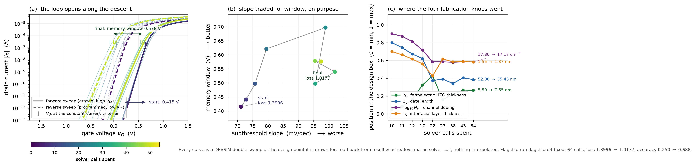
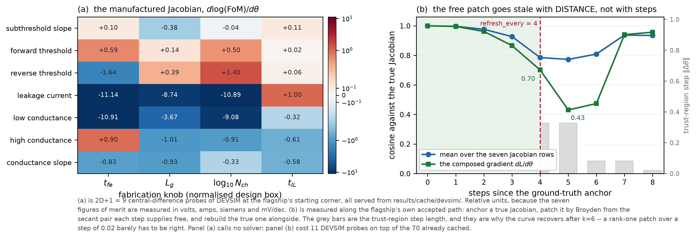
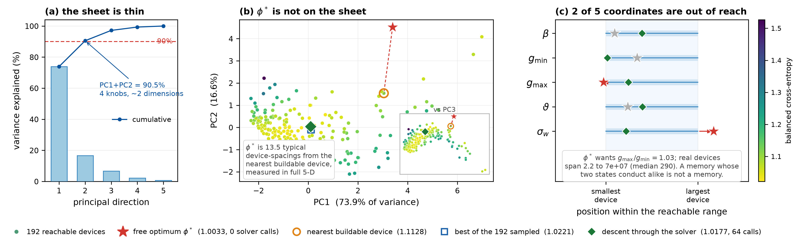
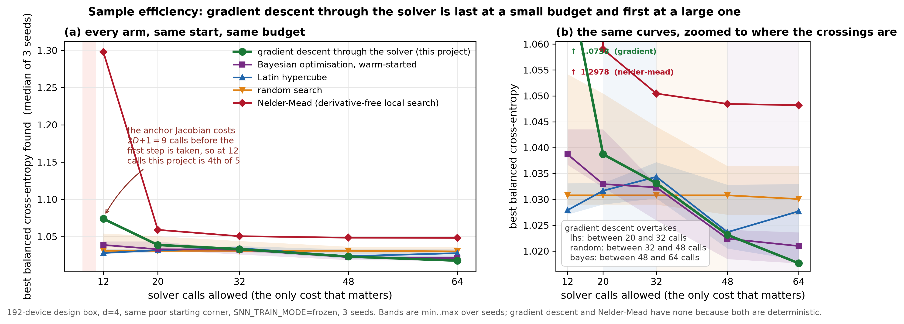
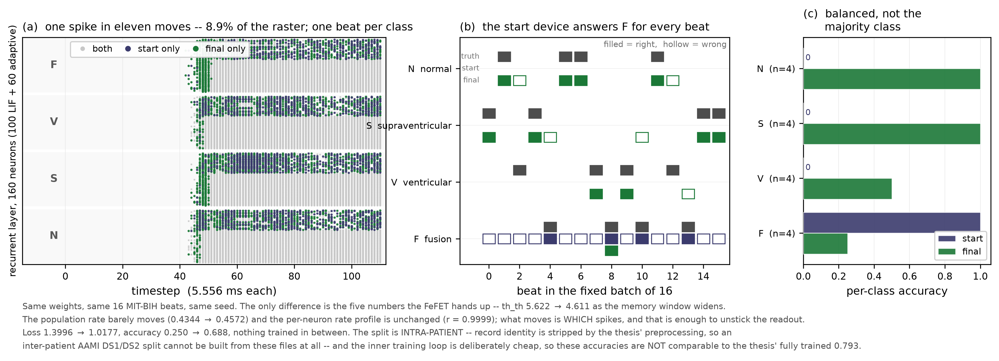
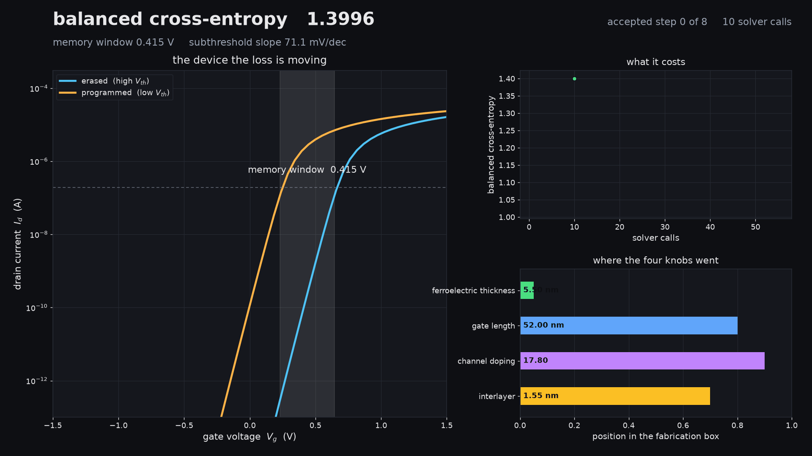

# Differentiable Silicon

**One gradient, running from the accuracy of a heartbeat classifier all the way back to the
fabrication parameters of the transistor its synapses are made from.**

[](https://github.com/hozaifa1/differentiable-silicon/actions/workflows/ci.yml)
[](LICENSE)

Tesseract Hackathon 2026 (Pasteur Labs & ISI) · Track 3: Hybrid ML + Mechanistic Models

---

## What this does

A spiking neural network classifies heartbeats from an ECG. A spiking network is one whose
neurons communicate in discrete pulses over time rather than in continuous numbers, which makes
it a natural fit for hardware: you can build its synapses out of real devices instead of
simulating them in software.

The device here is a **ferroelectric transistor**. A ferroelectric is a material that holds an
electrical polarization after you remove the field that created it, and flips to the other
polarization when you push hard enough the other way. Put a film of one in a transistor's gate
and the transistor's conductance remembers which state it was left in, which is what makes it
usable as a synapse. How the device behaves depends on how it was manufactured: how thick that
ferroelectric film is, how long the gate is, how heavily the channel is doped. Each of those
changes the device, and therefore changes how well the network classifies.

That dependency is normally broken by hand. A device engineer picks a figure of merit, maximises
it in a physics simulator, and hands over a device. An ML engineer takes the device as given and
trains on whatever arrives. Neither one ever sees the other's objective.

This repository closes that loop with a derivative. It takes the classification loss at the far
end and pushes it backwards through the spiking network, through the circuit that turns a device
into a neuron, and into the device simulator itself, arriving at ∂L/∂(process parameters): a
number for how much the classifier improves per nanometre of ferroelectric film. Then it runs
gradient descent on those numbers and finds a better device.

The last hop is the hard one. The simulator is **Synopsys Sentaurus**, a TCAD solver (Technology
Computer-Aided Design: the physics codes the semiconductor industry uses to predict how a device
will behave before anyone fabricates it). It is a closed-source Fortran and C++ binary with no
derivative of any kind, and it is driven from `csh` over an SSH hop to a CentOS 7 host carrying
Python 2.7.5 and nothing else. So the gradient in this repository crosses three mutually unaware
automatic-differentiation regimes (none, PyTorch, JAX), that SSH hop, and that binary.

**Every forward value here is ground truth from the real solver. Only the derivative is
manufactured**, by directed finite-difference probes of that same solver: poke each input, watch
how the outputs move, and assemble a Jacobian out of the answers.

Descending that gradient took balanced cross-entropy from **1.3996 to 1.0177** and accuracy from
**0.250 to 0.688**, in **64 solver calls**. On the device side the same descent widened the memory
window (the voltage gap between the two remembered states) from **0.415 to 0.576 V**, and paid for
it in switching sharpness, **71 to 97 mV/dec**.

[](docs/figures/fig3_hysteresis_descent.png)

*That descent, in the device. (a) is the current through the transistor as the gate voltage is
swept up and back down: the gap between the two branches is the memory, and it opens as the
optimiser works. (b) is the trade being made, window bought with slope. (c) is where the four
fabrication knobs actually went. Every curve is a design point DEVSIM really solved, read back
from `results/cache/devsim/`, with nothing interpolated between steps.*

## The chain the gradient crosses

```
        theta (4 fabrication knobs, normalised to [0,1]^4)
          |  G : R^4 -> R^7      Sentaurus / DEVSIM. NO adjoint, and never will have one.
          v                      (T1 sentaurus-fefet | T2 devsim-fefet, via T3 adjoint-shim)
        y (7 figures of merit)
          |  H : R^7 -> R^5      DPI transducer. Pure JAX, exact, free.
          v
        phi (beta, g_min, g_max, th_th, sig_w)
          |  F : R^5 -> R        LSNN classifier. PyTorch.
          v
        L (class-balanced cross-entropy)
```

Reading it downwards: `theta` is the four manufacturing parameters. `y` is the seven **figures of
merit**, the summary numbers that describe how the finished device behaves (memory window,
switching sharpness, on and off conductance, and so on). `H` is the transducer, a small exact
circuit model that converts those device numbers into the five parameters a neuron needs. `F` is
the classifier, and `L` is its loss. An **adjoint** is the reverse-mode derivative that lets you
run that chain backwards; a closed binary has none, which is what T3 exists to supply.

[](docs/figures/fig5_jacobian_and_decay.png)

*The manufactured derivative, made visible. (a) is the Jacobian at the flagship's starting corner,
built from 2D+1 = 9 central-difference probes of DEVSIM and served from cache. (b) is what the
free Broyden patch is worth as the optimiser walks away from that anchor: the cosine against the
true Jacobian falls to 0.43 by the fifth step, then climbs back once the trust-region steps
shrink. The patch goes stale with distance travelled, not with the number of steps taken.*

## The four Tesseracts

A **Tesseract** is the unit of packaging this hackathon is built around: a component sealed in a
container behind a fixed input/output schema and a standard set of endpoints, so that pieces
written in different languages and frameworks can be composed and differentiated together.
`apply` runs the component forward. `abstract_eval` reports the shape of the output without doing
the work. `jacobian`, `jvp` and `vjp` are the derivative endpoints, and a component that cannot
differentiate itself simply does not publish them. `vjp` (vector-Jacobian product) is the one
backpropagation needs; `jvp` is its forward-mode counterpart.

| | Name | Wraps | Differentiation | Endpoints |
|---|---|---|---|---|
| **T1** | `sentaurus-fefet` | Synopsys Sentaurus 2023.12, Preisach ferroelectric | none (closed binary) | `apply`, `abstract_eval` |
| **T2** | `devsim-fefet` | DEVSIM 2.10 (Apache-2.0) + clean-room Miller FE gate | none | `apply`, `abstract_eval` |
| **T3** | `adjoint-shim` | trust-region finite differences + Broyden black-box adjoint | NumPy/JAX | `apply`, `abstract_eval`, `jacobian`, `jvp`, **`vjp`** |
| **T4** | `snn-lif-ecg` | thesis LSNN (100 leaky integrate-and-fire neurons + 60 adaptive, delayed synapses) on 2000 MIT-BIH ECG beats | PyTorch autograd | `apply`, `abstract_eval`, **`vjp`**, `jvp` |

T1 and T2 are the same device in two solvers, one commercial and closed, one open. T3 is the
piece that manufactures a derivative for whichever of them is in play. T4 is the network, taken
from the author's thesis rather than invented here, trained on beats from MIT-BIH, the standard
public arrhythmia database.

T3 proxies its forward pass straight to whichever oracle `ORACLE_URL` points at, so the forward
value is never a surrogate; only `vjp` is.

## What is optimised, and what is not

The design vector is the four **fabrication** knobs: ferroelectric thickness, gate length,
channel doping, interfacial-layer thickness. Remanent polarization and coercive field, the two
numbers describing how strongly the film polarises and how hard you must push to flip it, are
**locked** to the measured HZO film (P_r = 32 µC/cm², P_s = 40 µC/cm², E_c = 1.4 MV/cm) and the
optimiser refuses to move them.

That restriction is the point, not a limitation. P_r and E_c are properties of a deposited film:
you change them by depositing a different film and re-calibrating, not by asking a fab for a
different number. An optimiser given them will widen the memory window by changing the material
and present it as a design result. Every result here is obtained on one fixed film.

The ECG split is **intra-patient**, matching the reference protocol, so the same patient's beats
can appear on both sides of the train/test line. The curated beat files have record identity
stripped during preprocessing, so an inter-patient AAMI DS1/DS2 split, the stricter protocol that
keeps a patient wholly on one side, cannot be constructed from them; see
`src/diffsilicon/snn/ecg.py`. Numbers here are not comparable to inter-patient results.

Details and the full before/after: [`docs/D3_RECALIBRATION.md`](docs/D3_RECALIBRATION.md).

## Reproduction: four tiers

The four tiers differ in what you have to install and what you are allowed to run. Tier A needs
nothing but Python. Tier B adds Docker. Tier C replays banked commercial-solver output with
neither. Tier D is for readers who hold a Sentaurus license themselves.

**Tier A: no Docker, no license.** The complete pipeline against an analytic mock oracle,
in-process via `Tesseract.from_tesseract_api()`. Proves every wire, every schema, every gradient hop.

```bash
uv sync --extra snn --group dev && uv run pytest
```

`--extra snn` is not optional: T4 is the PyTorch end of the gradient path, so `torch` is a
requirement of Tier A, and `uv sync --group dev` alone leaves the test collection failing on
`ModuleNotFoundError: No module named 'torch'`.

**Timed on a fresh clone into a fresh venv, not estimated:** `uv sync` 74 s, then **352 s cold /
314 s warm** for the 152 tests that run (6 skip without DEVSIM). The cold/warm gap is small because
`results/cache/mock/` is only 124 KiB. Nearly all of that time is the spiking network itself, 111
timesteps per beat in float64. Budget six minutes, not two.

**Tier B: Docker, no license.** The solver moves into a container, and the machine running the
pipeline stops needing one. Three commands, no login:

```bash
docker pull ghcr.io/hozaifa1/devsim-fefet:latest
```

```bash
tesseract serve ghcr.io/hozaifa1/devsim-fefet:latest --port 8101 -e MKL_NUM_THREADS=1 -e OMP_NUM_THREADS=1 -e MKL_THREADING_LAYER=SEQUENTIAL -e DIFFSILICON_CACHE_ROOT=/tmp/diffsilicon-cache
```

The first three are not decoration. MKL picks its pivoting by thread count, and on a machine where
that count is large the factorization inside DEVSIM dies with a divide-by-zero after Newton has
already converged to 1e-13. The solves here are small, so one thread costs nothing. The fourth
gives the container's cache somewhere writable. Without it the records are not kept and the
returned values are identical.

```bash
ORACLE_URL=http://localhost:8101 uv run pytest tests/test_tier_b_served.py -v
```

Note what is *not* in that environment: no `--extra devsim`, no BLAS, no license. The solver is in
the container; the host only orchestrates.

**Swapping the closed-source commercial solver for the open one is one environment variable.**
Nothing else in the pipeline changes (not the shim, not the transducer, not the network, not the
optimiser) because `sentaurus-fefet` and `devsim-fefet` publish a byte-identical frozen schema.
[`tests/test_tier_b_served.py`](tests/test_tier_b_served.py) is that claim tested across the wire
rather than asserted: the served container's OpenAPI schema against the frozen one, the returned
figures of merit against the values DEVSIM gave on the development machine (1%, on a different OS
with a different BLAS underneath), a guard that fails if anything falls back to the analytic mock,
and `jax.grad` all the way to `dL/dθ` with nine container solves in the middle. It runs on every
push as the **Tier B** job in [CI](https://github.com/hozaifa1/differentiable-silicon/actions/workflows/ci.yml).
That job pulls the published image with `docker logout ghcr.io` in front of it, so a package that
quietly went private fails there, before it ever reaches you.

All five images are on GHCR and public. The digests below were read with an
anonymous pull token, so they are what an unauthenticated clone resolves too, and
the `devsim-fefet` line is the exact image the green Tier B job pulled and ran the
gradient through. Pin by digest, as `ghcr.io/hozaifa1/<image>@<digest>`. A digest
never moves; `latest` moves on every push to `main`, which is why this table
exists. Read 31 Aug 2026:

| Tesseract | Image | Pinned digest |
|---|---|---|
| T1 | `ghcr.io/hozaifa1/sentaurus-fefet` | `sha256:941bfd927135ad365885e0c1c6d7d4b4b528e6f611ea0e1721ea3d3e3e4eeec5` |
| T2 | `ghcr.io/hozaifa1/devsim-fefet` | `sha256:c627349d17001b57494394545ad5c962fd1966067142bf4a62216a9296c864d6` |
| T3 | `ghcr.io/hozaifa1/adjoint-shim` | `sha256:1510e1a6ba26f7bb2d35db65502da8e5adb358482f81fb8a6200c283ec20f7f4` |
| T4 | `ghcr.io/hozaifa1/snn-lif-ecg` | `sha256:2452910c10f88f89f14486e78b91adea3509a51c803f1fad50275f2762664ee1` |
| mock | `ghcr.io/hozaifa1/mock-oracle` | `sha256:9df1c6e23005057e81bddfb51a2cd5bfd0d692d001a1ab17861ae7d452c6eaf6` |

An earlier revision of this table pinned the 30 Aug builds. Those digests still
pull, and the `devsim-fefet` one among them cannot solve: it predates the mkl
line in `tesseracts/devsim-fefet/tesseract_requirements.txt`, so it loads DEVSIM,
serves the frozen schema, and then has nothing that can factor a matrix.

### Running an optimisation

```bash
python scripts/run_flagship.py --backend devsim --d 4 --max-oracle-calls 120 --trust-radius 0.08 --theta0 0.05,0.80,0.90,0.70 --tag flagship
```

That is the exact command behind every headline number here: balanced
cross-entropy **1.3996 -> 1.0177** and accuracy **0.250 -> 0.688** in **64
solver calls**, banked at `results/runs/flagship-d4-fixed/`. `--d 3` is refused
on purpose: it exposes P_r and E_c, which are locked material constants.

The run starts from a deliberately poor corner of the design box: a thin, weakly polarised film
whose memory window is too small to separate the two conductance states. It is capped by solver
calls rather than by a convergence criterion, because a finite-difference Jacobian over a commercial
solver is bought by the call and a budgeted run is one you can start before bed. It writes
`steps.jsonl` and `result.json` as it goes, and the per-step trust-region ratios in that file are
validation item V5.

**Tier C: regenerates every Sentaurus number with no license and no network.**
`results/cache/sentaurus/` is a content-addressed replay of every Sentaurus call ever made: each
result is filed under a hash of the inputs that produced it, populated as a side effect of every
run rather than reconstructed at the end.

```bash
uv run python scripts/tier_c_replay_d6.py
```

This is checked, not claimed. The script blocks `socket` and `subprocess` and strips every
`SENTAURUS_*` variable from the environment before it touches project code, then regenerates
**164 of 164 float64 values bit-identically** (every figure of merit in
`rebaseline_d3_sentaurus.json` and every entry of the V4 cross-solver Jacobian) in **1.4 s**,
standing in for **0.93 h** of commercial-solver time. If anything came off the solver rather than
the cache it fails with a traceback instead of returning a number.

Figure 3 replays the same way, from `results/cache/devsim/`, with no solver call:

```bash
uv run python scripts/fig3_hysteresis_descent.py
```

Figure 4 does not. It needs the 2000 curated MIT-BIH beats, and **this repository deliberately
does not ship them**: they are the thesis' own preprocessing of a public database, and this repo
is public. Set `DIFFSILICON_ECG_DIR` to the folder holding `up/` and `down/` and it runs; without
it, the numbers behind the figure are banked in `results/runs/fig4_spike_raster.json`. The network
weights it needs are committed (`results/cache/w0/`), so nothing is retrained either way.

**Tier D: bring your own license.** See [`docs/T1_CONTAINER.md`](docs/T1_CONTAINER.md) and
`.env.example`. `t1/Dockerfile` expects the Sentaurus tree bind-mounted at `/opt/synopsys` and takes
`SNPSLMD_LICENSE_FILE` for license-server passthrough; the flagship itself runs uncontainerised, and
that document explains why.

Every figure and every banked measurement carries a sha256 in
[`results/manifest.json`](results/manifest.json), so you can tell whether the figure you are
looking at is the one the writeup describes:

```bash
uv run python scripts/make_manifest.py --check
```

## Documents

- [`docs/WRITEUP.md`](docs/WRITEUP.md): **the case-study report.** The composition, the
  adjoint, the results, the limitations, and the two upstream bugs.
- [`docs/D1_FINDINGS.md`](docs/D1_FINDINGS.md): every gate result, every measured
  number, and the eleven places where a measurement overruled the plan.
- [`docs/D2_FINDINGS.md`](docs/D2_FINDINGS.md): the open oracle, and the four things
  that were wrong underneath it: a body that punched through, a stiff equation the device
  did not need, three silent traps in DEVSIM's expression language, and a classifier
  that was never trained.
- [`docs/D3_RECALIBRATION.md`](docs/D3_RECALIBRATION.md): locking the material, and
  wiring the device under the thesis' own validated LSNN instead of a network invented
  for this project.
- [`docs/D3_FINDINGS.md`](docs/D3_FINDINGS.md) · [`docs/D4_FINDINGS.md`](docs/D4_FINDINGS.md)
  · [`docs/D5_FINDINGS.md`](docs/D5_FINDINGS.md) · [`docs/D6_FINDINGS.md`](docs/D6_FINDINGS.md):
  the daily measurement logs, including the corrections. D4 section 6 is superseded by
  D5 and carries a banner saying so.
- [`docs/T1_CONTAINER.md`](docs/T1_CONTAINER.md): why the flagship Tesseract runs
  uncontainerised, and what the driver has to survive on a csh-only CentOS 7 host.
- [`docs/UPSTREAM.md`](docs/UPSTREAM.md): two bugs found by using the toolkit rather
  than reading it, with the motivating case in this repository.

## Figures

Figure 3 is above, in [What this does](#what-this-does), and figure 5 in [The chain the gradient
crosses](#the-chain-the-gradient-crosses). The remaining three are here. Click any figure for the
full-resolution version; each one also has a vector PDF beside it in `docs/figures/`.

### Figure 1: what a device can actually hand the network

[](docs/figures/fig1_pca_manifold.png)

*Two principal directions carry **90.5%** of the variation across 192 devices, so four fabrication
knobs buy roughly two dimensions of neuron behaviour. The freely optimised phi\* sits **13.5**
typical device-spacings off that sheet: it scores well, and no device can be built to sit there.
Panel (c) says why. It wants a ferroelectric memory whose two states conduct almost alike, and a
memory whose two states conduct alike is not a memory.*

### Figure 2: does the gradient pay for itself

[](docs/figures/fig2_budget_crossover.png)

*Sample efficiency against solver calls, which is the only cost that matters when each call is a
solver run. The anchor Jacobian costs 2D+1 = 9 calls before the first step is even taken, so at a
12-call budget this project comes fourth of five. It overtakes Latin hypercube between 20 and 32
calls, random search between 32 and 48, and Bayesian optimisation between 48 and 64. Gradient
descent is the only arm that keeps converting extra budget into performance; random search is flat
to six decimal places from 12 calls to 48.*

### Figure 4: what the better device does to the classifier

[](docs/figures/fig4_spike_raster.png)

*Same weights, same 16 beats, same seed. The only thing that changed is the five numbers the device
hands up. The layer does **not** fire more (rate 0.4344 → 0.4572, per-neuron correlation 0.9999):
**one spike in eleven moves**, and that is enough to unstick a readout that had been answering one
class for all sixteen beats. Nothing was retrained in between.*

### The descent as footage

[](docs/figures/anim_descent.gif)

*The same descent as thirteen seconds of footage rather than one static panel. Every frame is a
design point DEVSIM actually solved, replayed from `results/cache/devsim/`; nothing between two
steps is interpolated. `scripts/anim_descent.py` redraws it, and `anim_descent.mp4` is the same
animation in a smaller file.*

## Status

Gate numbers (G2, G3, ...) and validation items (V3, V4, V5) are this project's own checklist
labels, defined in the findings documents above.

| | |
|---|---|
| Contract | **frozen**: `OracleInput` / `OracleOutput`, seven smooth FoMs |
| Extraction | all seven within **0.5 %** of a closed-form reference across the design box |
| Smoothness (G4) | ~5e-7 against a 0.15 threshold; the metric halves exactly under grid refinement |
| V3 `check-gradients` | **0 failures / 56 checks** on the shim, in CI on every push, under the central-difference refresh the checker assumes. See [WRITEUP §3](docs/WRITEUP.md) for the two conditions and the default-mode number |
| Open oracle (G2) | DEVSIM converges a pn diode, 5.9 decades of rectification |
| Open oracle (G5) | **passed**: hysteretic Id–Vg, memory window **0.394 V** against a 0.1 V gate, ~36 s per design point |
| Containers (G3) | all five build and push to GHCR from CI |
| Tier B (served container) | **green**: the published image pulled with no login, served, and `jax.grad` taken through it in 94 s: schema over the wire, no mock fallback, every component of dL/dθ finite and non-zero |
| Tier C (Sentaurus replay) | **verified**: 164 of 164 float64 values bit-identical, with sockets and subprocesses blocked; zero orphan cache entries |
| Provenance (G10) | 5,749 forward evaluations logged with backend and input hash; all 15 flagship steps present, a real solver wrote every one |
| Tests | **158**, lint clean |

## License

Apache-2.0. Only self-authored input decks and numeric outputs are published here: no Synopsys
binaries, no Synopsys-shipped parameter files, no `.cmd` fragments from Synopsys documentation.
